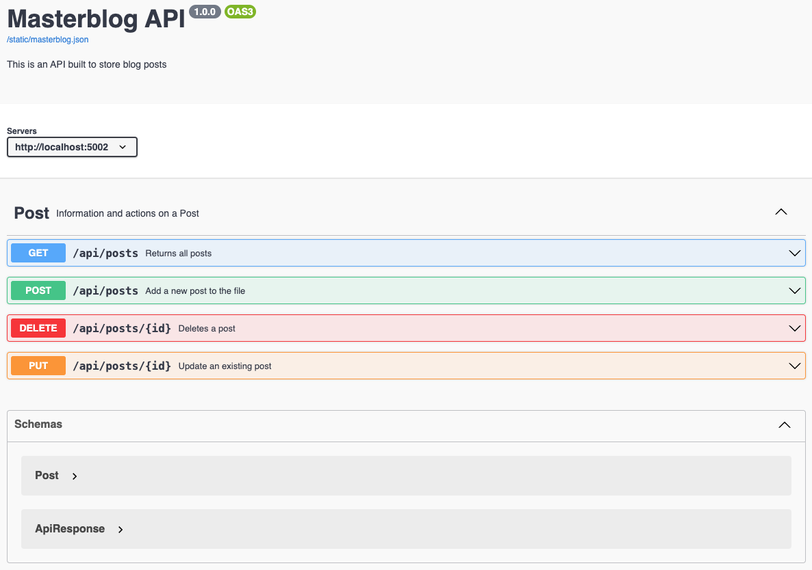
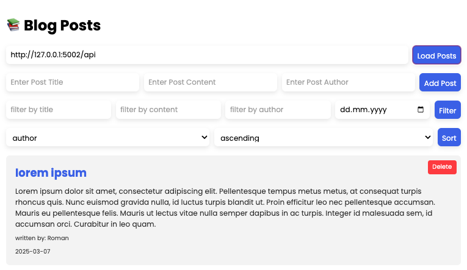

# ***MasterblogAPI***
an API build for your blog posts

## Purpose 💡

Masterblog is first and foremost an REST API, giving the user an option to work with following methods:
* GET
* POST
* PUT
* DELETE

The user also has an option to sort and filter the posts. 

## API documentation 📑
MassterblogAPI has a detailed documentation built in swagger which is available under localhost/api/dosc

## Set up 🏗️
To set the app up, simply clone this repository and install all the dependencies specified in "requirements.txt".
This project does not have user identification and API_KEY is not necessary. 

## Usage 💻
MasterblogAPI has both back and front end. Feel free to use POSTMAN to interact with the API.

Starting backend: 
>python3 backend/backend_app.py

For those preferring to have an UI, alongside backend_app, run frontend_app:

Starting frontend:
>python3 frontend/frontend_app.py

Front end is designed using a mix of HTML and JS. The design is simple and readable. 
Please have in mind that update function (API PUT method) is currently not supported by front end side.

